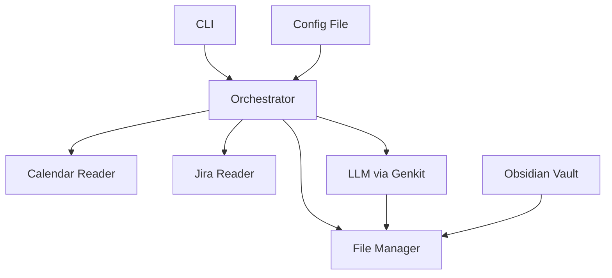

# Design Document

## Overview

The AI-Assisted Daily Planning System follows a simple local-first architecture where Markdown serves as the system of record. The design emphasizes learning AI integration patterns while keeping complexity minimal for a single-user personal project.

**Personal Project Simplifications:**
- Single user (no multi-tenancy concerns)
- Local files only (no database needed)
- Simple configuration (single config file)
- Basic error handling (fail fast, log clearly)

**Full Product Considerations:**
- Would need user management and authentication
- Database for user data and preferences
- Robust error handling and retry logic
- API rate limiting and quota management
- Horizontal scaling and load balancing

## Architecture

Simple pipeline architecture for single-user local operation:



**Personal Project Approach:**
- Direct function calls (no complex interfaces)
- Simple structs (no over-abstraction)
- Minimal error handling (log and exit)
- Single config file

**Full Product Differences:**
- Would use dependency injection
- Comprehensive interface abstractions
- Circuit breakers and retry logic
- Database abstraction layer
- Metrics and monitoring

## Components and Interfaces

### CLI
Simple command handler with basic commands:
```go
func HandleCommand(cmd string, args []string) error
func StartChat(prompt string) error
func Configure() error
```

### Orchestrator
Core workflow coordinator:
```go
func PlanDay(userPrompt string) (*DayPlan, error)
func ChatAboutPlan(prompt string, currentPlan *DayPlan) (*DayPlan, error)
```

### File Manager
Simple file operations:
```go
func ReadDailyNote(date time.Time) (*DailyNote, error)
func WriteDailyNote(note *DailyNote) error
func ReadWeeklyNote(date time.Time) (*WeeklyNote, error)
```

### External Data
Basic data fetching:
```go
func FetchCalendarEvents(icalURL string, date time.Time) ([]Event, error)
func FetchJiraTickets(config JiraConfig) ([]Ticket, error)
```

**Personal Project Simplifications:**
- Functions instead of interfaces (YAGNI)
- Basic error handling (log.Fatal on critical errors)
- No retry logic or circuit breakers
- Direct struct passing

**Full Product Considerations:**
- Interface-based design for testability
- Comprehensive error handling with retries
- Graceful degradation when services are down
- Request/response logging and metrics

## Data Models

Simple structs for personal project:

```go
// Core data structures
type Config struct {
    JiraURL      string   `json:"jira_url"`
    JiraToken    string   `json:"jira_token"`
    VaultPath    string   `json:"vault_path"`
    CalendarURL  string   `json:"calendar_url"`
    PIIPatterns  []string `json:"pii_patterns"`
}

type DailyNote struct {
    Date         time.Time
    Goals        string
    Meetings     string
    BonusItems   string
    OtherContent string
}

type DayPlan struct {
    Goals       []string
    Meetings    []string
    Summary     string
    Changes     string  // Human-readable description of what changed
}

type Event struct {
    Title       string
    Description string
    Date        time.Time
}

type Ticket struct {
    ID          string
    Summary     string
    Description string
    Status      string
    Priority    string
}
```

**Personal Project Approach:**
- Simple flat structs
- Basic JSON serialization
- No complex validation
- Direct field access

**Full Product Considerations:**
- Nested configuration with validation
- Database models with relationships
- Comprehensive field validation
- API versioning and backwards compatibility
    CreateDailyNote(date time.Time) (*DailyNote, error)
    ReadWeeklyNote(date time.Time) (*WeeklyNote, error)
    UpdateDailyNoteSections(note *DailyNote, updates *SectionUpdates) error
    ParseExistingGoals(note *DailyNote) ([]Task, error)  // Parse current goals from existing note
    RefreshDailyNote(date time.Time) (*DailyNote, error) // Re-read note to get latest changes
}
```

**Section Management**:
```go
type SectionUpdates struct {
    Goals      *string
    Meetings   *string
    BonusItems *string
}
```

The adapter must:
1. Read full Markdown content
2. Identify the three target sections (Goals, Meetings, Bonus Items)
3. Replace only those sections
4. Preserve all other content byte-for-byte

### Configuration Manager

**Responsibility**: Manage application configuration and credentials

**Key Functions**:
1. Interactive configuration setup (similar to `aws configure`)
2. Secure storage and retrieval of credentials
3. Configuration validation
4. Default value management

**Interface**:
```go
type ConfigManager interface {
    InitializeConfig() error
    LoadConfig() (*Config, error)
    SaveConfig(config *Config) error
    ValidateConfig(config *Config) error
}
```

**Configuration Model**:
```go
type Config struct {
    JiraConfig    JiraConfig    `json:"jira"`
    VaultConfig   VaultConfig   `json:"vault"`
    CalendarConfig CalendarConfig `json:"calendar"`
    SanitizationConfig SanitizationConfig `json:"sanitization"`
    LLMConfig     LLMConfig     `json:"llm"`
}

type JiraConfig struct {
    BaseURL   string `json:"base_url"`
    Username  string `json:"username"`
    APIToken  string `json:"api_token"`  // Stored securely
}

type VaultConfig struct {
    Path string `json:"path"`
}

type CalendarConfig struct {
    ICalURL string `json:"ical_url"`
}

type SanitizationConfig struct {
    PIIPatterns []string `json:"pii_patterns"`
}

type LLMConfig struct {
    OllamaURL string `json:"ollama_url"`
    ModelName string `json:"model_name"`
}
```

**Configuration File Location**: `~/.planner/config.json`
**Secure Storage**: API tokens stored using OS keychain/credential manager when available

### Sanitization Layer

**Responsibility**: Remove PII and sensitive data before LLM processing

**Configuration**: Regex patterns loaded from configuration file

**Interface**:
```go
type SanitizationLayer interface {
    SanitizeText(text string) string
    SanitizeJiraTicket(ticket *RawJiraTicket) (*SanitizedJiraTicket, error)
    LoadPatternsFromConfig(config *SanitizationConfig) error
}
```

**Characteristics**:
- Deterministic regex-based approach
- One-way transformation (not reversible)
- Applied before any LLM interaction
- Configurable via configuration file patterns

## Data Models

### Core Planning Models

```go
type PlanningContext struct {
    WeeklyGoals      []string
    CalendarEvents   []CalendarEvent
    JiraTickets      []SanitizedJiraTicket
    CurrentDailyNote *DailyNote
    CarryoverTasks   []Task
}

type DailyNote struct {
    Date            time.Time
    GoalsSection    string
    MeetingsSection string
    BonusItemsSection string
    OtherContent    string  // Preserved content outside target sections
}

type Task struct {
    Description string
    Completed   bool
    Source      string  // "goals", "bonus_items", "jira", "weekly"
}
```

### LLM Communication Models

```go
type PlanningSession struct {
    ID              string
    Context         *PlanningContext
    ConversationHistory []ConversationTurn
    CurrentPlan     *LLMPlan
    Status          string  // "active", "ready_to_apply", "applied"
}

type ConversationTurn struct {
    UserInput    string
    SystemResponse string
    Timestamp    time.Time
}

type ConversationResponse struct {
    Response        string
    UpdatedPlan     *LLMPlan
    ChangePreview   *ChangePreview
    CapacityAnalysis *CapacityAnalysis
    ReadyToApply    bool
}

type CapacityAnalysis struct {
    CurrentLoad     string  // "light", "moderate", "heavy", "overbooked"
    SuggestedTasks  []SuggestedTask
    Reasoning       string  // Human-readable explanation
    HasMeaningfulGaps bool   // Whether there are gaps suitable for focused work (2+ hours)
}

type SuggestedTask struct {
    Description string
    Source      string  // "jira_backlog", "weekly_goals", "maintenance"
    Effort      string  // "focus_block" (2+ hours), "quick_task" (30min-1hr)
    Priority    string
    Reasoning   string  // Why this task fits the available capacity
}

type LLMPlan struct {
    UpdatedGoals          []string
    UpdatedMeetings       []Meeting
    CarryoverDecisions    map[string]string  // task_id -> "carry_forward" | "defer" | "drop"
    ConversationalSummary string
    QuestionsForUser      []string
}

type ContextualTask struct {
    Description string
    Source      string  // "user_context", "jira", "weekly_goals", "capacity_fill"
    Priority    string
    Placement   string  // "morning", "afternoon", "after_meeting_x", etc.
}

type ChangePreview struct {
    GoalsChanges      string  // Text showing what will be added/changed in Goals
    MeetingsChanges   string  // Text showing what will be added/changed in Meetings
    BonusItemsChanges string  // Text showing what will be added/changed in Bonus Items
    Summary           string  // Human-readable summary of all changes
}

type Meeting struct {
    Title     string
    NeedsLink bool
    LinkPath  *string  // Format: "YYYY/MM/Meeting Name"
}

type ApplyResult struct {
    Success     bool
    FilesChanged []string
    Summary     string
    Error       error
}
```

### Capacity Tracking Models

```go
type CapacityAssessment struct {
    Date                time.Time
    UnplannedWorkLevel  string  // "a little", "some", "mostly unplanned", "everything was unplanned"
    RollingAverageFactor float64
}

type CapacityHistory struct {
    Assessments []CapacityAssessment
}

func (ch *CapacityHistory) CalculateRollingAverage(days int) float64 {
    // Implementation for rolling average calculation
}

func (ch *CapacityHistory) PredictCapacityBuffer() float64 {
    // Implementation for capacity buffer prediction
}
```

## Correctness Properties

*Simple properties for a personal project - focus on core functionality that must work correctly.*

**Property 1: File Safety**
*For any* daily note modification, the system should preserve all content outside the Goals, Meetings, and Bonus Items sections.

**Property 2: PII Sanitization**
*For any* Jira data sent to the LLM, all configured PII patterns should be removed first.

**Property 3: Calendar Processing**
*For any* calendar event, the system should extract title and description while excluding time information.

**Property 4: Conversational Flow**
*For any* user prompt, the system should provide a response and allow iterative refinement before applying changes.

**Personal Project Approach:**
- Focus on 4-5 core properties that matter most
- Simple property-based tests with basic generators
- Manual testing for edge cases

**Full Product Considerations:**
- Comprehensive property coverage (25+ properties)
- Sophisticated test data generation
- Automated regression testing
- Performance and load testing

## Error Handling

**Personal Project Approach:**
- Log errors clearly and exit gracefully
- Basic validation with helpful error messages
- Fail fast on configuration issues

**Full Product Considerations:**
- Comprehensive error recovery
- Circuit breakers and retries
- Graceful degradation
- User-friendly error reporting

## Testing Strategy

**Personal Project Testing:**
- Unit tests for core functions
- Property tests for the 4 key properties above
- Manual integration testing
- Simple test data fixtures

**Full Product Testing:**
- Comprehensive unit and integration test suites
- Property-based testing with complex generators
- Load testing and performance benchmarks
- Automated end-to-end testing
- Chaos engineering for resilience testing
